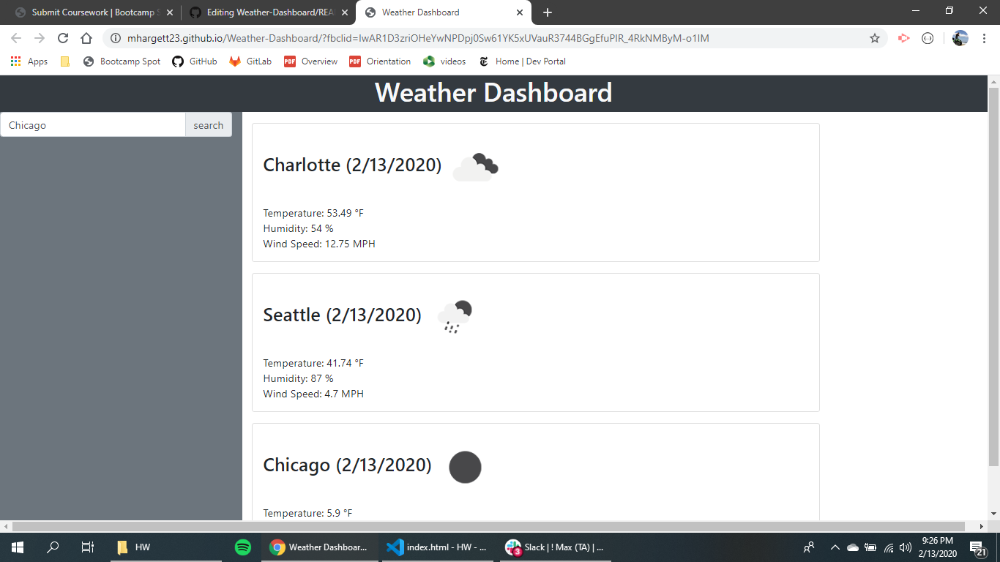

# Weather Dashboard

### User Story  
As a traveler  
I want to see the weather outlook for multiple cities  
so that I can plan a trip accordingly  

<<<<<<< HEAD
### Usage
After searching for a city, the following information is displayed:  

<ul><li>Current temperature</li>  
<li>Current humidity</li>
<li>Windspeed</li>
<li>Application uses icons to represent weather conditions</li>
<li>Results from previous city remain on the screen</li></ul>

<ul><li>Sort the table by at least one category</li>
<li>Filter the users by at least one property.</li></ul>  

[Visit this website](https://mhargett23.github.io/Weather-Dashboard/)

=======
deployed application can be found here: https://mhargett23.github.io/Weather-Dashboard/
  

<strong>After searching for a city, the following information is displayed:</strong> 

<ul>
<li>Current temperature</li> 
<li>Current humidity</li> 
<li>Windspeed</li> 
<li>Application uses icons to represent weather conditions</li> 
<li>Results from previous city remain on the screen</li>
</ul>
>>>>>>> 3c4cffd9ce6338d2e5a3665fbce2c6fd06ec65fd
